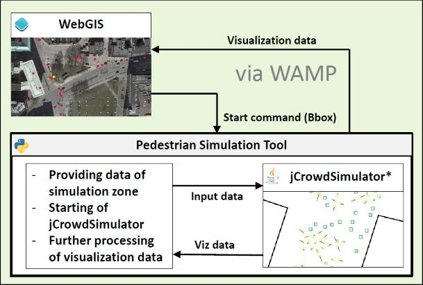

# ABPedSim
ABPedSim is a prototype tool for agent based pedestrian simulation in urban environments.

The idea behind this tool is to combine pedestrian simulation concepts and agent based modelling with 
the research findings of pedestrian behavior on public spaces made by social urban scientists and computer scientist. 
ABPedSim therefore adapt a pedestrian simulation software using the Social Force Model of 
[Helbing et al. (2005)](https://pubsonline.informs.org/doi/pdf/10.1287/trsc.1040.0108) and extends it with ideas of 
agent based modelling.

## Components
+ Module for generating input data and handling output (Python)
+ Pedestrian Simulation adapted from [jCrowdSimulator](https://github.com/FraunhoferIVI/jCrowdSimulator) (Java)
+ WebGIS (JavaScript)
+ Communication via WAMP-Service of [crossbar.io/AutobahnPython](https://crossbar.io)

## Getting started
The simulation should run with the provided python script, the html-file in the webgis-folder (get your key for BingMaps) 
and the executable jar-file. For the communication between the components you have to set up a server (url & realm) 
and insert the names for the following topics:
+ starting the simulation
+ point data transfer
+ linestring data transfer (visualization not implemented in provided webgis)

You should provide the following data:
+ shapefile with the boundaries of buildings, obstacles etc. as polygons
+ shapefile with point data of subway stations
+ shapefile with point data of bus stations
+ shapefile with point data of bike stations
+ shapefile with point data of parking lots
+ shapefile with a routing network for pedestrians

## Credits
+ Initial idea, data and first application: Project [SmartSquare](http://www.smartsquare.hamburg), [HafenCity University](https://www.hcu-hamburg.de/), Hamburg
+ JCrowdSimulator: [Fraunhofer IVI, Fraunhofer Institute for Transportation and Infrastructure Systems](https://www.ivi.fraunhofer.de/en.html), Dresden

## Publication
...follows

## Contact
[Martin Knura](http://www.geomatik-hamburg.de/g2lab/knura.html)
